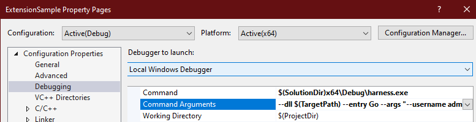
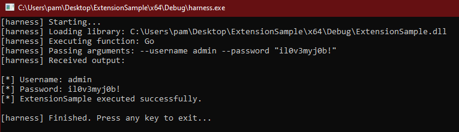

# ExtensionSample

A simple C++ shared library for exectuion via Sliver's `extension` functionality.

## Description
Microsoft Visual Studio solution that contains a sample dll that implements Sliver's `callback` API for `extensions` and a `harness` program that can be used to debug the extension locally, without Sliver.

## Features
- enhanced argument parsing
- callback API helper functions

## Start
Open the solution in Microsoft Visual Studio, then perform the following steps:

1. Build the `harness` project
2. Modify the `ExtensionSample` project's properties, and under debug set the following fields:

    - command: `$(SolutionDir)x64\Debug\harness.exe`
    - arguments: `--dll $(TargetPath) --entry Go --args "--username admin --password \"il0v3myj0b!\""`



3. Debug the `ExtensionSample` project



## Sliver
Add the extension to sliver:

1. Create a TAR archive (`.tar.gz`) with the `extension.json` manifest and the `ExtensionSample.dll` files
2. Install with sliver: `extensions install /tmp/extsample.tar.gz`
3. Load with sliver: `extensions load /root/.sliver-client/extensions/extsample`

Run it

```
sliver (HAPPY_BROOK) > extsample -- --username admin --password \"s3cr3t passphrase\"

[*] Successfully executed extsample
[*] Got output:
[*] Username: admin
[*] Password: s3cr3t passphrase
[*] ExtensionSample executed successfully.
```

## See also
- [Learning Sliver C2 (12) - Extensions](https://dominicbreuker.com/post/learning_sliver_c2_12_extensions/) for blog all about Sliver extensions
- [sliverarmory/azbelt](https://github.com/sliverarmory/azbelt) for an extension written with NIM
- [sliverarmory/hashdump](https://github.com/sliverarmory/hashdump) for an extension written with GO